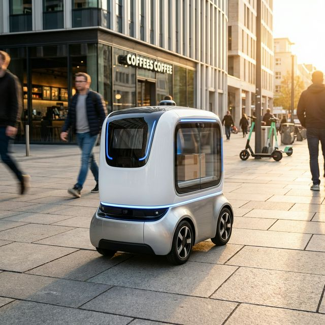

# 🛰️ BOTdar: Autonomous Machine Census

**BOTdar** is a premium, real-time tracking and classification system for the autonomous machine era. Built with a high-fidelity "Void Black" aesthetic, it utilizes AI to identify, classify, and census the growing population of sidewalk couriers, aerial drones, and autonomous vehicles in our urban environments.

 *Note: Simulation mode active for prototype.*

## ✨ Core Features

- **🌐 Global Mesh Radar**: A high-density Mapbox interface tracking verified signals across the grid.
- **🤖 AI Machine Deconstruction**: Powered by **Google Gemini**, providing surgical identification of hardware models and **BOT score** (operational efficiency) analysis.
- **🍱 Bento Dashboard**: A data-dense, modular HUD for system monitoring, mesh health, and local bot index (AQM).
- **👁️ Tactical Viewfinder**: Interactive camera scanning interface with cinematic AI overlays.
- **🛰️ Satellite-Linked Database**: Real-time pinning of sightings to a global census via Supabase.

## 🛠️ Technology Stack

- **Framework**: [Next.js 15+](https://nextjs.org) (App Router)
- **Intelligence**: [Google Gemini Pro Vision](https://ai.google.dev/)
- **Mapping**: [Mapbox GL JS](https://www.mapbox.com/)
- **Database**: [Supabase](https://supabase.com/) (PostgreSQL + PostGIS)
- **Animation**: [Framer Motion](https://www.framer.com/motion/)
- **Icons**: [Lucide React](https://lucide.dev/)

## 🚀 Getting Started

### 1. Clone the Uplink
```bash
git clone https://github.com/YOUR_USERNAME/BOTdar.git
cd BOTdar
```

### 2. Configure Environmental Interlocks
Create a `.env.local` file with the following keys:
```env
NEXT_PUBLIC_MAPBOX_ACCESS_TOKEN=your_mapbox_token
GEMINI_API_KEY=your_gemini_token
NEXT_PUBLIC_SUPABASE_URL=your_supabase_url
NEXT_PUBLIC_SUPABASE_ANON_KEY=your_supabase_key
```

### 3. Initialize Sensor Array
```bash
npm install
npm run dev
```

Open [http://localhost:3000](http://localhost:3000) to view the census.

## 🧪 Prototype Simulation Mode

This version of BOTdar is configured as a **"Model Prototype"** for demonstration purposes:
- **Synthetic Mesh**: The map background uses a procedure-generated SVG urban wireframe instead of live Mapbox tiles to ensure 100% uptime without API dependencies.
- **Simulation Deck**: The scanner cycle uses a randomized simulation deck (Couriers, Drones, Humanoids) with cinematic POI overlays.
- **Mission Control SF**: All sightings are currently pinned to the San Francisco "Mission Control" sector with a local storage fallback for persistence.

*To transition to live production: Replace the `.env.local` keys and toggle the `Navigation.geolocation` interlock in `app/scan/page.tsx`.*

## 🤝 Collaborating

To share this project with a co-developer:

1.  **Push to Git**: Ensure all changes are committed and pushed to a shared repository (GitHub, GitLab, etc.).
2.  **Share Environment Keys**: The `.env.local` file is *not* committed to git for security. varied
    -   Securely share your `GEMINI_API_KEY` and Mapbox token with your teammate.
    -   They must create their own `.env.local` file in the root directory.
3.  **Run Development Server**:
    -   `npm install` (to get dependencies)
    -   `npm run dev` (to start the local server)

## 🌎 Share the Prototype (No Keys Required)

The current version of BOTdar is configured to run in **"Keyless Preview Mode"**. You can deploy it to Vercel/Netlify without adding any API keys, and it will automatically default to the Simulation Deck.

To see it live immediately:
1.  Run `npx vercel` in this directory.
2.  Follow the prompts (hit Enter for defaults).
3.  You'll get a production URL (e.g., `https://botdar-prototype.vercel.app`) to share.

---

*“If you see a bot, you scan a bot. The census must match the reality.”*
